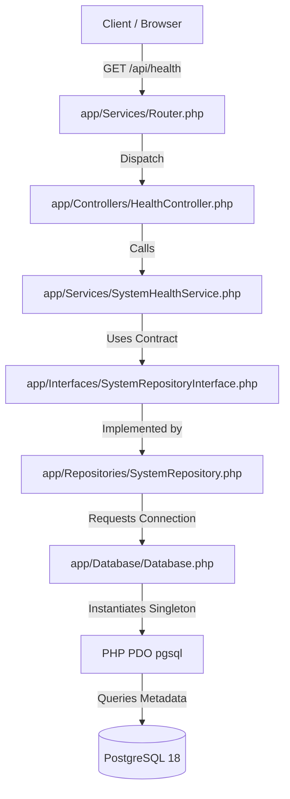

# FinTrack Pro Backend — Premium Architecture Setup (Phase 1)

Welcome to the backend architecture repository of **FinTrack Pro**. This document details the architectural guidelines, layout directories, configurations, coding standards, and installation procedures established during Phase 1.

---

## 1. Architectural Overview

The backend of FinTrack Pro is designed using modern software engineering patterns for a robust, decoupled, and highly testable implementation:
*   **Object-Oriented PHP (8.3+)**: Leveraging strict typing, read-only properties, constructor promotion, and union types.
*   **SOLID Principles**: Emphasizing Single Responsibility and Dependency Inversion.
*   **Layered Architecture (Separation of Concerns)**:
    *   **Controllers Layer**: Handles incoming HTTP requests, maps input parameters, delegates tasks to services, and returns a unified JSON API format.
    *   **Services Layer**: Houses the core domain logic (e.g. calculations, business rules, notification triggers).
    *   **Repositories Layer**: Encapsulates data access mechanisms (PostgreSQL/PDO prepared statements in Phase 2).
    *   **Interfaces / Dependency Inversion**: Decouples services from database adapters to ensure the storage system is easily swappable.
*   **Centralized Configuration**: All variables are loaded dynamically from environment files (`.env`) into cohesive configuration files under `config/`.
*   **Unified API Response Standard**: Every request returns a predictable response format for the frontend.

---

## 2. Directory Layout

The workspace is organized as follows:

```text
fintrack-pro/
├── app/
│   ├── Controllers/    # Receives HTTP parameters & dispatches API responses
│   │   └── HealthController.php
│   ├── Services/       # Business/Domain logic (e.g. ROI calculations, budgets)
│   │   └── Router.php  # Regex-based application routing engine
│   ├── Repositories/   # Encapsulates data access operations
│   ├── Models/         # Entity schemas and database attributes
│   ├── Middleware/     # Request filtering (Auth, RateLimiting, Session verification)
│   ├── Helpers/        # Reusable application helpers
│   │   ├── Logger.php
│   │   └── ResponseHelper.php
│   ├── Validation/     # Server-side data validation classes
│   └── Interfaces/     # Shared contract interfaces for Dependency Inversion
├── config/             # Centralized PHP arrays for settings
│   ├── app.php
│   ├── constants.php   # Application-wide default constant arrays
│   ├── database.php
│   └── mail.php
├── database/           # DB schema versioning
│   ├── migrations/     # Versioned table structures (Phase 2)
│   ├── seeders/        # Default database content seeding (Phase 2)
│   └── schema/         # Placeholder for SQL schema dumps and logs
├── routes/             # Route configurations mapping URIs to Controllers
│   └── api.php
├── storage/            # Local data directories (denied direct web access)
│   └── logs/           # Application error and status logging
├── tests/              # Test suites
│   └── verify_backend.php
├── public/             # Web root placeholder
├── vendor/             # Autoloaded Composer packages
├── .env.example        # Local configuration template (credentials omitted)
├── .gitignore          # File exclusions (vendor/, .env, logs ignored)
├── bootstrap.php       # Application environment bootstrapping
├── composer.json       # Dependencies config and PSR-4 settings
└── README_BACKEND.md   # Developer reference manual (this file)
```

---

## 3. Core Framework Subsystems

### A. Bootstrapping (`bootstrap.php`)
Responsible for:
1.  Checking that `vendor/autoload.php` is available (preventing blank pages if dependencies are missing).
2.  Loading environment variables safely using `vlucas/phpdotenv`.
3.  Defining the `config()` helper function supporting dot-notation array keys.
4.  Establishing secure session settings:
    *   `session.cookie_httponly = 1`
    *   `session.cookie_secure` (resolved dynamically based on SSL availability)
    *   `SameSite` set to `Lax`.
5.  Registering global exception and error handlers to log stack traces and return clean, masked errors in production.

### B. Standard API Response Standard (`app/Helpers/ResponseHelper.php`)
To ensure frontend-backend contract consistency, all responses follow the schema:
```json
{
  "success": true, 
  "message": "Information text",
  "data": { ... },
  "errors": { ... }
}
```
*   **Success Status**: HTTP 200/201.
*   **Validation Failures**: HTTP 422 with validation errors listed in the `errors` object.
*   **Exceptions/Critical Failures**: HTTP 500/404 with errors masked under production, and traces exposed only under development (`APP_ENV=development`).

### C. Logging Subsystem (`app/Helpers/Logger.php`)
Writes system activities to `storage/logs/app.log`.
*   **Security Masking**: Automatically detects sensitive keys (e.g. `password`, `token`, `secret`, `db_password`) in log context payloads and replaces their values with `********`.
*   **Context Capture**: Automatically appends IP Address, HTTP Request Method, and Route URIs to all logs.

### D. Routing Subsystem (`app/Services/Router.php`)
A regex-based router that supports path-matching, dynamic parameters (e.g. `/api/expenses/{id}` parsed into `$id`), and middleware injections.

---

## 4. Coding Standards

We follow PHP community standards strictly:
1.  **PSR-12**: Extended Coding Style Guide.
2.  **PSR-4**: Autoloading mapping for `App\\` to `app/`.
3.  **Strict Typing**: Every file must declare `declare(strict_types=1);` on line 1.
4.  **No Uncaught Errors**: Native PHP warnings are caught, promoted to `ErrorException`, and handled cleanly.
5.  **Sensitive Secrets**: Credentials must never be written in codebase logic; use `.env` exclusively.

---

## 5. Installation & Setup

1.  **Verify PHP Version**:
    ```bash
    php -v # Must be PHP 8.3 or higher
    ```

2.  **Install Composer Dependencies**:
    From the project root directory, run:
    ```bash
    composer install
    ```
    This downloads:
    *   `vlucas/phpdotenv` (Environment Manager)
    *   `phpmailer/phpmailer` (SMTP Mail Handler)
    *   Generates autoloader classes mapping `App\` namespaces.

3.  **Configure Environment**:
    Copy the sample configuration file to `.env`:
    ```bash
    cp .env.example .env
    ```
    Configure your specific parameters (database, mail credentials, app url).

4.  **Run Backend Verification Test**:
    Execute the validation script to verify that syntax, logging, configuration, and routing are fully functional:
    ```bash
    php tests/verify_backend.php
    ```

---

## 6. Phase 2: PostgreSQL Database Integration

Phase 2 introduces a professional-grade PostgreSQL database integration using PHP Data Objects (PDO). The implementation enforces strict typing, connection retries, secure logging, automatic transaction rollbacks, and a clean layered architecture.

### A. Database Setup & Compatibility
1. **Engine**: Local PostgreSQL 18.
2. **Database Name**: `fintrack_db`.
3. **Database-Agnostic Design**: The connection layer uses standard PDO pgsql driver configuration. Migrating from local PostgreSQL to Supabase in the future requires only changing the connection variables in the `.env` file.
4. **Persistent Connections**: Disabled (`PDO::ATTR_PERSISTENT => false`) to prevent connection leaks, lock resources, or pollute session states in standard PHP-FPM / serverless environments.

### B. Environment Variables (`.env`)
The database connection requires the following variables:
```env
# Core Application Settings
APP_NAME=FinTrackPro
APP_ENV=development  # Set to 'production' to mask traces and errors
APP_URL=http://localhost:8000

# Database Configuration (PostgreSQL ready)
DB_HOST=127.0.0.1
DB_PORT=5432
DB_DATABASE=fintrack_db
DB_USERNAME=postgres
DB_PASSWORD=your_secure_password
DB_SSLMODE=prefer # 'require' or 'prefer'
```

### C. Architecture Diagram


### D. Connection & Verification Process
1. **Validation**: Before opening a connection, the `Database` class checks that all required variables (`DB_HOST`, `DB_PORT`, `DB_DATABASE`, `DB_USERNAME`, `DB_PASSWORD`) are present in the environment.
2. **Lazy Loading**: The PDO connection is not established until `Database::connection()` is explicitly called.
3. **Connection Retries**: If the initial connection fails, the class retries up to 3 times with a 100ms delay between attempts.
4. **Secure Error Logging**: Connection exceptions are caught and logged into `storage/logs/database.log`.
   - In **production mode** (`APP_ENV=production`), exception stack traces are excluded, and all passwords, usernames, and database names in the log message are masked with `********`.
   - In **development mode** (`APP_ENV=development`), full stack traces are logged, and SQL queries are logged for debugging (Query Execution Logging).
5. **Timezone & Client Encoding**: Immediately after connecting, the timezone is initialized to `UTC` (`SET timezone TO 'UTC'`), and the client encoding is forced to `UTF8`.

### E. Database Verification Utility
To verify that the database integration is functional, run:
```bash
php verify_database.php
```
This utility:
- Requires the framework's bootstrap loader.
- Verifies environment credentials.
- Initiates the retry-capable lazy connection.
- Calls the `SystemHealthService` / `SystemRepository` to output PostgreSQL version, current database name, active user, and timestamp.

---

## 7. Phase 3: PostgreSQL Database Schema, Migrations & Core Data Architecture

Phase 3 introduces a professional PostgreSQL database schema, an automated migration engine, a system category seeder, and a schema verification framework.

### A. Core Architecture & Financial Data Strategy
- **UUID Primary Keys**: All application tables use 128-bit globally unique identifiers (`UUID`) generated using the cryptographically secure `gen_random_uuid()` function.
- **Financial Precision**: All monetary values (budgets, expenses, incomes, loan balances, savings target/current states, investment values) are stored as `NUMERIC(15,2)` or `NUMERIC(20,4)` (for share pricing) rather than float/double. This prevents floating-point rounding errors. CHECK constraints enforce positive values (`amount > 0` or similar).
- **Timezone Standardization**: All timestamps utilize the `TIMESTAMPTZ` data type to store time with timezone context, maintaining strict UTC alignment on the database server.
- **Auditing Integrity**: System changes are captured via append-only `audit_logs` capturing target records and JSONB objects representing `old_values` and `new_values`.

### B. Trigger Automations
A reusable trigger function `update_updated_at_column()` is declared during extension creation. Triggers are bound to all tables containing the `updated_at` column, ensuring the column automatically updates to `CURRENT_TIMESTAMP` before any update operation.

### C. Foreign Key & Soft Delete Strategies
- **Foreign Key Safety**: To ensure financial transactions and history do not vanish due to accidental deletions, categories and payment methods use safe deletion.
  - Deleting a category or a payment method sets the foreign key on corresponding income/expense rows to `NULL` (`ON DELETE SET NULL`) rather than performing a cascading delete.
  - Deleting a user cascade deletes user preferences, sessions, and notifications (`ON DELETE CASCADE`).
- **Soft Deletes**: Soft deletion (`deleted_at` TIMESTAMPTZ NULL) is applied to tables that hold financial assets or ledgers (`users`, `income`, `expenses`, `savings_goals`, `investments`, `loans`) so that historical transactions remain accessible for audits and analytics even when archived.

### D. Table Registry
The following 22 tables compose the core database architecture:

1. **`schema_migrations`**: Tracks executed migration file names to ensure idempotency.
2. **`users`**: User registration records, role constraints (`user`, `admin`), failed login attempt locks, and statuses (`active`, `inactive`, `blocked`, `suspended`).
3. **`categories`**: System categories (user_id is NULL) and custom user categories. Scoped check: type (`income`, `expense`).
4. **`payment_methods`**: Cash, bank, card, upi, wallet, other. Scoped to users.
5. **`income`**: Scoped income records. Checked amount > 0.
6. **`expenses`**: Scoped expense records. Checked amount > 0.
7. **`receipts`**: Receipts attached to expenses.
8. **`budgets`**: Category budget thresholds per month and year per user.
9. **`savings_goals`**: Savings target profiles (`active`, `completed`, `paused`, `cancelled`).
10. **`savings_contributions`**: Incremental deposits matching savings goals.
11. **`investments`**: Stocks, mutual funds, gold, crypto, fixed deposits, epf, etc.
12. **`investment_history`**: Snapshots of investment valuations over time.
13. **`loans`**: Personal, education, or home loans with EMI tracking.
14. **`emi_payments`**: Installment records (`pending`, `paid`, `overdue`, `cancelled`).
15. **`bill_reminders`**: Configurable bill due date reminders.
16. **`notifications`**: User alert system using JSONB structures for dynamic metadata.
17. **`user_sessions`**: Web session identifiers.
18. **`password_reset_tokens`**: Hashed password reset challenge tokens.
19. **`email_verification_tokens`**: Hashed registration verification tokens.
20. **`login_history`**: Audit trail of login attempts (`success`, `failed`, `blocked`).
21. **`activity_logs`**: Log streams tracking user operations.
22. **`audit_logs`**: Append-only records of data mutations (`old_values`, `new_values`).
23. **`user_settings`**: Currency (`INR`, `USD`), timezone, date format, and theme preferences.

### E. Indexing Strategy
To ensure optimal performance, indexes are established on the following fields:
- Foreign keys (`user_id`, `goal_id`, `loan_id`, `expense_id`, `investment_id`).
- Transaction dates (`income_date`, `expense_date`, `due_date`, `recorded_at`).
- Status values (`status`, `is_read`, `is_active`).
- Token hashes and expirations (`token_hash`, `expires_at`).
- Composite Indexes:
  - `income (user_id, income_date)`
  - `expenses (user_id, expense_date)`
  - `notifications (user_id, is_read, created_at)`
  - `audit_logs (table_name, record_id)`

---

## 8. CLI Command Directory

The database layers can be run and verified using the following utilities:

### A. Run Database Migrations
Execute the migration engine from the project root. It will safely apply all outstanding SQL migrations inside isolated database transactions:
```bash
php database/migrate.php
```
*Note: This command is idempotent. Running it a second time will safely skip already executed scripts.*

### B. Seed System Categories
Seed the default category profiles for income and expenses:
```bash
php database/seed.php
```
*Note: This seeder is idempotent. Repeated execution will not create duplicate categories.*

### C. Verify Database Schema
Execute the schema verification framework to assert database existence, table structures, trigger bindings, and check constraints:
```bash
php database/verify_schema.php
```
